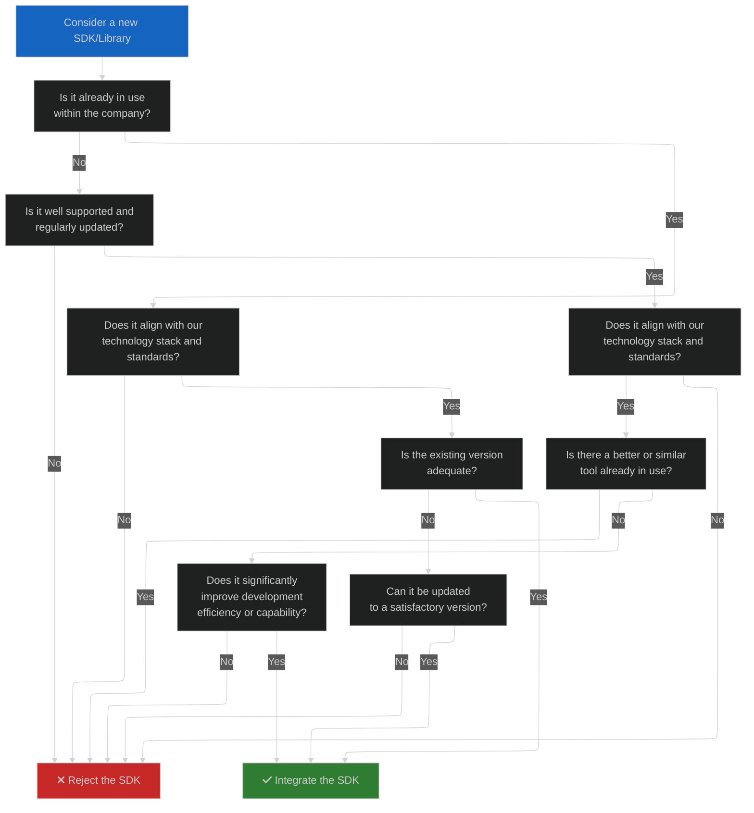

# SDKs and Libraries

This section provides comprehensive guidelines and a structured decision-making process for
selecting, updating, and integrating SDKs and libraries. It aims to standardize tool usage across
the company, ensuring efficiency and reducing technical debt.

## Benefits of a Coherent Ecosystem

1. **Improved Collaboration:** Using a consistent set of tools enhances team synergy and project
predictability.
2. **Streamlined Onboarding:** A standardized toolkit simplifies the onboarding process, enabling
quicker team member ramp-up.
3. **Better Productivity:** Common tools decrease redundancy, helping developers focus on innovation
rather than compatibility issues.
4. **Risk Management:** Well-supported tools reduce security vulnerabilities.
5. **Cost Efficiency:** Proper tool management cuts unnecessary costs associated with frequent
technology shifts.

## SDK/Library Integration Decision Chart

The flowchart below serves as a tool to guide the decision on whether to integrate a new SDK or
library. Use it to ensure that any addition is beneficial and sustainable.

<!-- TODO Restore this section once specific guidelines are ready

## Platform-Specific Guidelines

Refer to the pages dedicated to each platform for detailed information on recommended and essential
tools:

- **[Android SDKs and Libraries](./ANDROID.md)**
- **[Apple SDKs and Libraries](./APPLE.md)**
- **[Backend SDKs and Libraries](./BACKEND.md)**
- **[Data Handling Kits and Libraries](./DATA.md)**
- **[Infrastructure SDKs](./INFRASTRUCTURE.md)**
- **[Web SDKs and Libraries](./WEB.md)**

Each section provides curated lists of tools, integrating the decision-making principles from the
chart to ensure optimal tool selection and usage. This approach not only enhances efficiency but
also aligns with strategic development goals.
-->
