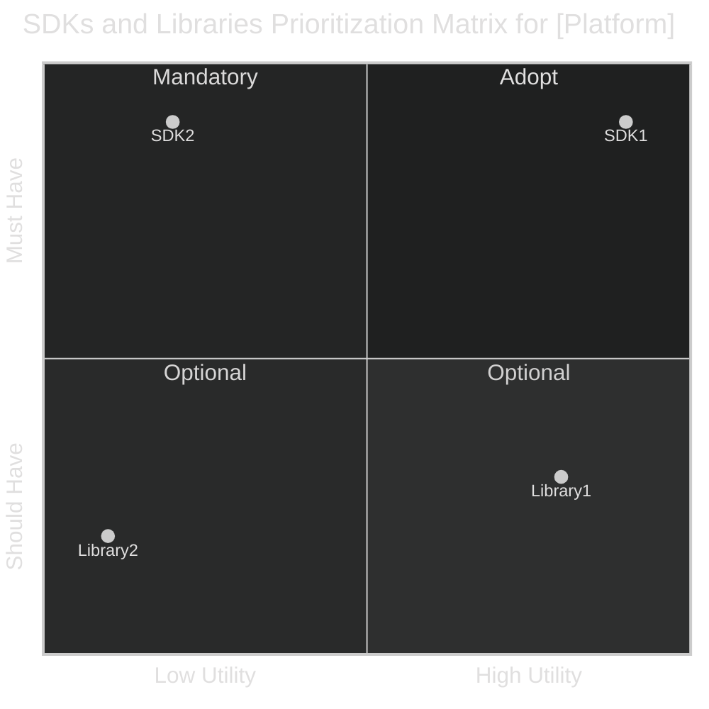

# [Platform] Development Kits and Libraries

This page outlines the recommended Development Kits and Libraries for [Platform] development. It
categorizes tools into **Must-Have**, **Should-Have**, based on necessity, and assesses their
utility to aid in selection. This guide ensures that all tools align with our company’s standards
and best practices.

## Overview

Below is a prioritization matrix that categorizes SDKs and libraries based on their utility and
necessity. This visual guide helps in quick decision-making regarding tool adoption.

For guidance on integrating or rejecting libraries and SDKs not listed in this guide, please consult
the [SDK/Library Integration Decision Chart](./INTRODUCTION?id=sdklibrary-integration-decision-chart).
Update this guide with your findings on new libraries and SDKs to ensure it remains a valuable
resource for your colleagues.

To view deprecated tools and their alternatives, visit
the [Deprecated Libraries and SDKs Section](#deprecated-kits-and-libraries).

> [!Note]
> The recommendations on this page are based on general guidelines which may not perfectly fit all
> project scenarios. Evaluate the specifics of your project when choosing tools.

## Must-Have Kits and Libraries

These are the essential tools required for development on [Platform]. They are supported actively
and are pivotal to our development practices.

- **SDK/Library Name 1**
  - **Purpose**: Explains its functions and why it is indispensable.
  - **Official Documentation**: [Link to documentation](#)
  - **References**: [Link to projects using this SDK/library](#)

_Continue listing other must-have SDKs and libraries as necessary._

## Should-Have Kits and Libraries

These tools, while not mandatory, are recommended as they enhance productivity and address common
issues effectively.

- **SDK/Library Name 1**
  - **Purpose**: Describes what it does and its benefits.
  - **Official Documentation**: [Link to documentation](#)
  - **References**: [Link to projects using this SDK/library](#)

_Continue listing other should-have SDKs and libraries as necessary._

## Deprecated Kits and Libraries

These tools are no longer recommended due to reasons such as obsolescence, lack of support, or the
availability of better alternatives.

- **SDK/Library Name 1**
  - **Reason for Deprecation**: Explains why the tool is deprecated.
  - **Suggested Alternatives**: [Link to alternative tool's documentation](#)
